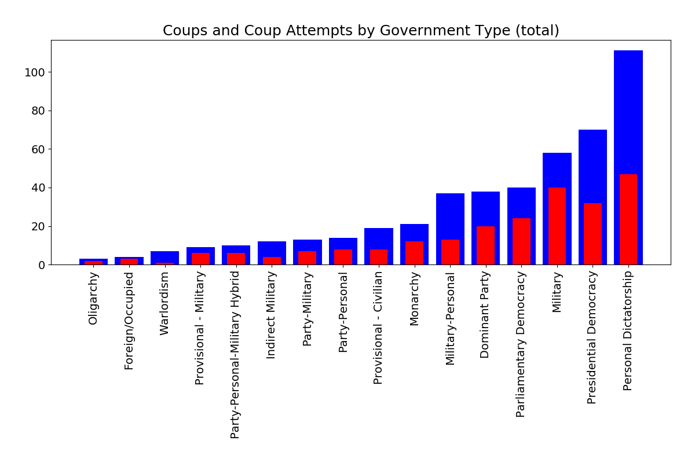
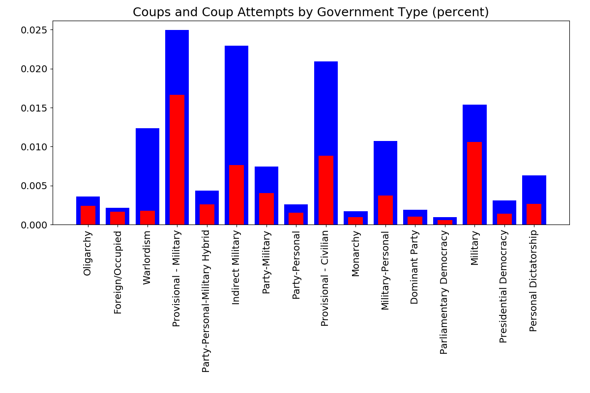
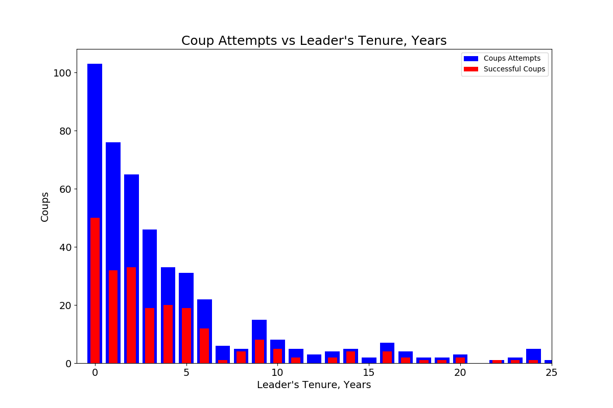

# Modeling Coups and Other Violent Power Transitions

## Introduction:

...........

# The Data

I used the REIGN dataset (see citation below) from One Earth Future for details on country leaders, government types, and when successful and attempted coups occured. I supplemented this with indicators from the Correlates of War project, which had information on population, trade, and militarization. 

The Reign dataset contained 135,637 rows covering January 1950 unitl March 2020, with 200 countries, 466 attempted coups (successful or unsuccessful) and 233 successful ones. 

By filtering the dataframe for months in which attempted coups took place and a certain country, it was sometimes possible to trace their tumultuous journey through the latter half of the 20th century. For instance, looking at Argentina below, you can see the overthrow of Juan Perón in 1955, followed by a decade and a half of successive coups. Perón returned to Argentina in 1973 but died the following year – his Vice President and wife, Isabel, took power, but was overthrown in 1976 and replaced by a junta  

# Data Cleaning

I created used a script to generate a variable that was a hybrid of the country code and the year for each row in the data, and used this to join the yearly data from the C.O.W. datasets with the monthly data in the REIGN dataset.

Combining several different datasets that spanned different ranges of time presented a problem – most of the C.O.W. datasets were missing years after 2010, while the indicators collected by the World Bank only began at 1960 at the earliest, although a cursory examination showed that many began quite a bit later. This meant that I had to decide whether to lose the 1950's or the most recent decade. I decided to work with the C.O.W. datasets and keep the earlier decade, which preserved more instances of my target, but did limit the range of features that I could add to the REIGN dataset. I was able to engineer some of the features I was interested in by combining columns in the C.O.W. datasets (for instance, the percentage of the population in the military and trade balance), but a lot of other potentially interesting indicators had to be left behind.  

# EDA

Bolivia had the largest number of both coups and attempted coups, with a number of other Latin American nations in the top 15.

Personal Dictatorships and Presidential Democracies suffered the greatest number of coups overall. This would seem to indicate that coups tend to occur (overall) in places which power is invested in a single person, whether democratically or not. 

When scaled by the number of months that each government type existed in the dataset, however, the interim government types (provisional civilian and provisional military) experienced the highest rate of coups, with indirect military rule also experiencing a high rate. This suggests, fairly intuitively, the government types associated with instability or miltary rule experience the most coups

Likewise, when looking at leader tenures, the largest number of coups happen within the first year of a leader's rule

Overall, coups appear to have spiked in the 1960's and subsequently declines, albeit with spikes in the mid-1970's (probably linked to operation CONDOR in South America) and the early 1990's (likely linked to the instability caused by the fall and dissolution of the USSR.)

# Feature Engineering

I decided to create some new features out of combinations of others – the trade balance for the country, the percentage of the population that was in the military, and the percentage of the population in urban areas. I also one hot encoded the different government types that were in the 'government' column.

# Modeling: 

A major challenge in modeling was the extreme imbalance of the classes: out of 106008 thousands rows (representing months between January 1950 and December 2006), only 443 had an attempted coup. A model that always predicted a coup wouldn't happen would automatically feature an accuracy upwards of 99.5%, but would completely miss the point of the investigation. Instead of focusing on accuracy, I was really curious about training a model with strong precision and recall. However, the thing I really cared about was interpretability of the model, so I decided to first focus on a creating an inferential model using a logistic regression. In order to avoid collinear features messing up the interpretation, I calculated the Variance Inflation Factors for the non-target features in my dataset and dropped features until everything had a score of below 10, which is the standard rule of thumb. 

In order to deal with the problem of imbalanced classes, I experimented with several tecniques while evaluating the performance of a simple logistic regression. I found that oversampling and SMOTE tended to perform fairly well, but SMOTE offered slightly better recall, so I primarily used SMOTE as my sampling technique (however, in my pipeline I did build in the option to try downsampling and upsampling instead.) I also made sure to stratify my target column when using a test train split to ensure that the model would have a reasonable number of targets to predict on when I tested it. 

Using a scaled version of my dataset, I used a logistic regression with 5-fold cross validation and an elastic net regularizar to derive a list of relative feature importances and their direction: 

- Logistic Regression

- Random Forest

- XGboost

# Results: Logistic Regression

accuracy = 0.71
recall = 0.78
precision = 0.01
f1 score = 0.02
accuracy + recall = 1.5

## Strongest Positive Indicators

| Feature                | Coefficient | Description |
|------------------------|-------------|-------------|
| milex                  |13.981701   | Military expenditures |
| trade balance          | 5.096419    | Trade balance (exports - imports) |
| lastelection           | 4.602407    | Months since the last election|
| prev_conflict          | 2.435943    | Dummy variable for a violent civil conflict in the past 6 months
| Provisional - Civilian | 1.853427    | Dummy variable for an interim civilian coverment |
| milper                 | 1.630274    | Total Military Personnel |
| Warlordism             | 1.462509    | Dummy variable for rule by warlords (currently applies to Yemen and Libya) |
| Military               |  1.404612    | Rule by a military junta |
| Indirect Military      | 1.357380    | Rule by a military junta with a civilian puppet |
| Military-Personal      |  1.339073    | Rule by a military junta consolidated around a single figure (ex. Pinochet in Chile) |

## Strongest Negative Indicators

| Feature             | Coefficient |  Description |
|------------------|------------|---|
| irst             | -56.0 | Iron and steel production |
| indirect_recent  | -9.4  | Dummy variable for the 6 months following an indirect election (controlled by elites rather than popular vote)  |
| population       | -7.6  | Total population  |
| irregular        | -4.9  | Dummy variable for an an anticipated irregular election  |
| mil_percent      | -4.5  | Military Personnel as a percentage of the total popuation  |
| ref_ant          | -2.2  | A referendum is expected in the next 6 months  | 
| year             | -2.0  | Year  |
| precip           | -0.8  | Precipition relative to histoical average  |
| loss             | -0.7  | Number of months since the incumbent or political party has lost an election (or changed, in the absence of elections) |
| leg_ant          | -0.7  | Dummy variable for a legislative election expected in the next 6 months  |

# Future Steps

Given more time, I would like to experiment with adding features from the World Bank dataset, however, given the inconsistency of the data, this will likely require a lot of extrapolation, and the differing country labels will require a lot of tedious cleaning and dictionary building. I would also like to experiment with more feature engineering, perhaps by creating new features that are nonlinear combinations of other features, which I think might identify interesting patterns and trends in the data.

#Citations:

##REIGN Dataset:

Bell, Curtis. 2016. The Rulers, Elections, and Irregular Governance Dataset (REIGN). Broomfield, CO: OEF Research. Available at oefresearch.org

The REIGN Dataset was constructed using the following resources:

Goemans, Henk E., Kristian Skrede Gleditch, and Giacomo Chiozza. 2009. "Introducing Archigos: A Dataset of Political Leaders" Journal of Peace Research, 46(2): 269-183. {{http://privatewww.essex.ac.uk/~ksg/archigos.html}}

Ellis, Cali Mortenson, Michael C. Horowitz, and Allan C. Stam. 2015. "Introducing the LEAD Data Set." International Interactions, 41(4): 718-741. {{http://www.tandfonline.com/doi/abs/10.1080/03050629.2015.1016157}}

Marshall, Monty G., Ted Robert Gurr, and Keith Jaggers. 2016. Polity IV Project. Center for Systemic Peace. {{http://www.systemicpeace.org/inscr/p4manualv2015.pdf}}

Barbara Geddes, Joseph Wright, and Erica Frantz. 2014. “Autocratic Regimes and Transitions.” Perspectives on Politics. 12(2).{{http://dictators.la.psu.edu/}}

Powell, Jonathan & Clayton Thyne. 2011. Global Instances of Coups from 1950-Present. Journal of Peace Research 48(2):249-259.{{http://www.jonathanmpowell.com/coup-detat-dataset.html}}

Erik Melander, Therése Pettersson, and Lotta Themnér (2016) Organized violence, 1989–2015. Journal of Peace Research 53(5) {{http://www.pcr.uu.se/research/ucdp/datasets/replication_datasets/}}

## Correlates of War Datasets

Trade:

Barbieri, Katherine and Omar M. G. Omar Keshk. 2016. Correlates of War Project Trade Data Set Codebook, Version 4.0. Online: http://correlatesofwar.org. 

Barbieri, Katherine, Omar M. G. Keshk, and Brian Pollins. 2009. “TRADING DATA: Evaluating our Assumptions and Coding Rules.” Conflict Management and Peace Science. 26(5): 471-491.

https://correlatesofwar.org/data-sets/bilateral-trade

Barbieri, Katherine, Omar M. G. Keshk, and Brian Pollins. 2009. “TRADING DATA: Evaluating our Assumptions and Coding Rules.” Conflict Management and Peace Science. 26(5): 471-491.

National Material Capabilities:

Singer, J. David, Stuart Bremer, and John Stuckey. (1972). "Capability Distribution, Uncertainty, and Major Power War, 1820-1965." in Bruce Russett (ed) Peace, War, and Numbers, Beverly Hills: Sage, 19-48.

https://correlatesofwar.org/data-sets/national-material-capabilities